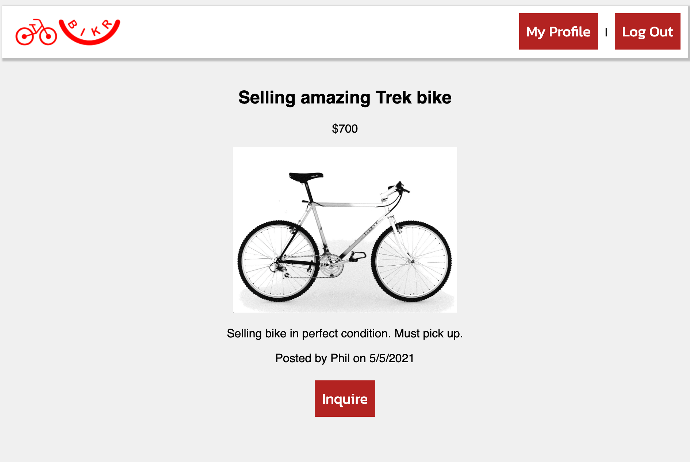
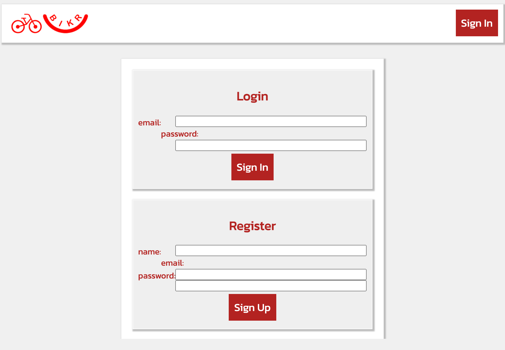
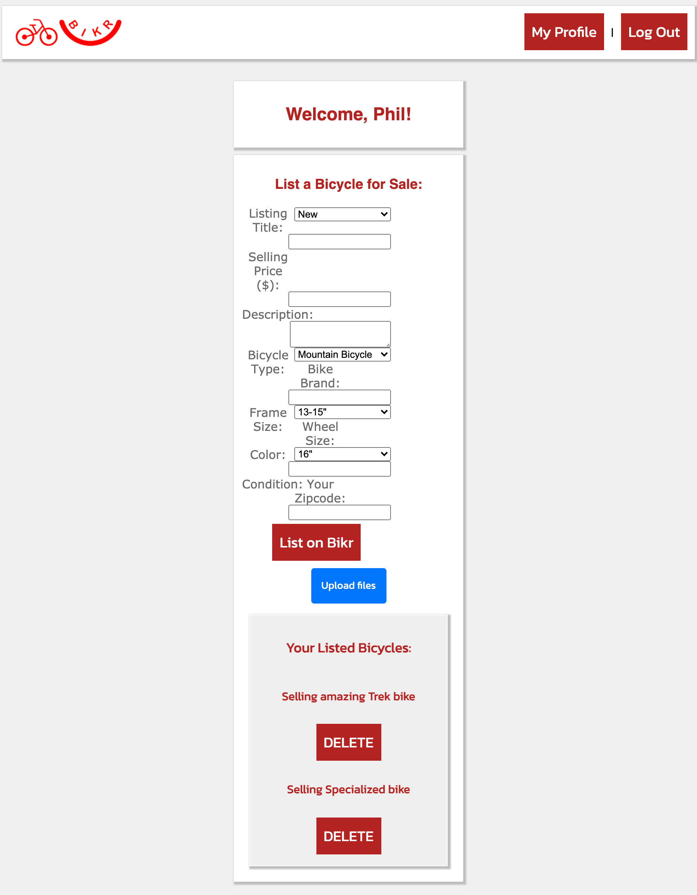

# PROJECT 02
## Bikr App
* [Live Link]()
* [Repo Link](https://github.com/stevenstefanov/bikr)

## Description
This is an application that lets New Yorkers buy and sell bicycles. In a city of traffic jams and subway construction, it sometimes seems that the most reliable way to get around town is by bike. However, Citi bikes aren't always the most comfortable and a nicer brank new bike can set you back a few hundred if not a few thousand dollars. Here is where Bikr comes in. It's the perfect place to buy and sell bicycles, unlike Craigslist which is too broad and crowded with items. Here, a person can know that they will see only bikes and can find the exact one they want.

## Usage/Acceptance Criteria
The application is very straight forward. Landing on the homepage, the user is presented with a list of all the bikes from the database and they can click into a certain listing to see more information about that bicycle. The user has the option to create an account and upon being logged in, they can still continue browsing or go to their dashboard where they are presented with a form to list their own bicycle for sale. After listing a bike, the users bike will be displayed on the homepage, as well as on their dashboard where they are able to delete a listing.

## Preview of App

# License
* MIT